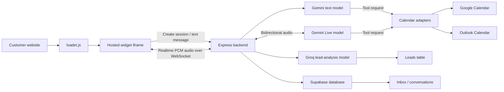

I’ve now mapped the current system end to end. There are **three separate model workloads**, and the knowledge base is not using embeddings or a vector database.

**Models In Use**

| Task | Provider/model | Where |
|---|---|---|
| Typed receptionist chat | Gemini `gemini-2.5-flash-lite` by default | [chatController.ts](D:\agilewaters\AI Receptionist\server\src\controllers\chatController.ts:7) |
| Realtime voice receptionist | Gemini `gemini-3.1-flash-live-preview` | [liveChatController.ts](D:\agilewaters\AI Receptionist\server\src\controllers\liveChatController.ts:162) |
| Lead extraction and scoring | Groq `llama-3.1-8b-instant` | [leadController.ts](D:\agilewaters\AI Receptionist\server\src\controllers\leadController.ts:39) |

## Overall Architecture



## 1. Website Widget

The customer installs:

```html
<script
  src="https://your-api.com/widget/loader.js"
  data-bot-id="BOT_UUID">
</script>
```

The loader:

1. Reads the public bot ID.
2. Creates the launcher button.
3. Fetches the bot’s UI configuration.
4. Opens an iframe from `/widget/:botId`.
5. Grants the iframe microphone permission.

This happens in [widgetController.ts](D:\agilewaters\AI Receptionist\server\src\controllers\widgetController.ts:35).

The model is **not downloaded or embedded in the customer website**. The customer website only contains a loader and iframe. All model calls happen from the Express backend.

## 2. Typed Chat

The widget creates a session, then sends:

```http
POST /api/chat/reply
{
  "sessionId": "...",
  "userMessage": "...",
  "timezone": "Asia/Calcutta"
}
```

The backend:

1. Resolves the session and bot.
2. Validates the website domain.
3. Loads conversation history from Supabase.
4. Loads the bot’s business name, industry, knowledge base, and customization.
5. Builds a Gemini system prompt.
6. Calls Gemini.
7. Executes calendar tools when requested.
8. Stores both messages.
9. Starts Groq lead analysis asynchronously.

The orchestration is in [chat.routes.ts](D:\agilewaters\AI Receptionist\server\src\routes\chat.routes.ts:28).

### Knowledge Base

There are currently **no embeddings**.

The complete `bot.knowledge_base` text is inserted directly into every Gemini prompt:

```text
BUSINESS CONTEXT & KNOWLEDGE BASE:
${bot.knowledge_base}
```

That is simple and effective for small knowledge bases, but larger content will increase token usage and may exceed model context limits.

### Calendar Tools

Gemini receives two function definitions:

- `check_availability(date)`
- `book_appointment(details)`

Gemini decides when to request a tool. Express executes the request against the calendar service and returns the result to Gemini.

The actual calendar operation is therefore backend-controlled. Gemini never receives Google OAuth tokens or Supabase service credentials.

There are additional backend safeguards:

- Only one appointment per session.
- Requested time must exactly match an available slot.
- Availability is checked again before booking.
- Appointments are saved in Supabase.

See [calendarController.ts](D:\agilewaters\AI Receptionist\server\src\controllers\calendarController.ts:79).

## 3. Live Voice

Live voice does not use browser speech recognition. It is a realtime audio connection:

```text
Microphone
  → 16 kHz PCM audio
  → Widget WebSocket
  → Express WebSocket proxy
  → Gemini Live
  → 24 kHz PCM response
  → Browser speakers
```

The browser never sees the Gemini API key. Express opens the provider WebSocket and proxies audio between the widget and Gemini.

Gemini Live performs:

- Speech recognition
- Conversation reasoning
- Tool calling
- Speech generation
- Interruption handling

It uses the same business knowledge and calendar tools as text chat, but its message protocol is completely separate.

The voice configuration currently uses:

- Model: `gemini-3.1-flash-live-preview`
- Voice: `Aoede`
- Input: 16 kHz PCM
- Output: 24 kHz PCM
- Maximum call duration: 9 minutes
- Maximum simultaneous calls: 3

## 4. Lead Analysis

Groq is not speaking to visitors. It works behind the scenes.

After every typed response, Express sends the current transcript to `llama-3.1-8b-instant`. It extracts:

- Name
- Phone number
- Requirement
- Budget
- Lead score
- Sentiment
- Summary
- Appointment status

The result is upserted into the `leads` table using `session_id` as the unique conversation identifier.

If Groq is unavailable or `GROQ_API_KEY` is missing, chat continues normally, but the lead record is not updated.

## 5. Supabase Responsibilities

Supabase currently handles:

- Authentication
- Agent configurations
- Knowledge bases
- Allowed domains
- Widget customization
- Chat sessions
- Messages
- Leads
- Calendar OAuth connections
- Appointments

The dashboard reads conversations and leads directly from Supabase using RLS-controlled frontend access.

## Active vs Legacy Code

The active deployment path is:

```text
server/src/index.ts
```

Railway starts it using:

```bash
npx tsx src/index.ts
```

The following are older duplicated implementations:

- `server/controllers/*`
- `server/supabase/functions/chat-reply`
- `server/supabase/functions/analyze-lead`

They are not part of the normal Railway request path. The frontend and embedded widget currently use the Express service.

## Important Current Limitations

1. **No semantic retrieval:** the whole knowledge base is injected into every prompt.
2. **Voice Inbox completeness:** voice currently persists bot transcript text, but normal user speech is not reliably persisted as a transcript.
3. **History selection:** typed chat requests the first 20 messages in ascending order rather than the latest 20, which could lose recent context in long conversations.
4. **Lead analysis frequency:** Groq runs after every typed turn, potentially producing unnecessary cost.
5. **Model configuration:** text Gemini is configurable through `GEMINI_MODEL`; voice and Groq models are hardcoded.
6. **Provider abstraction:** there is currently no common model-provider interface.
7. **Gemini is mandatory:** the server refuses to start without `GEMINI_API_KEY`; Groq is optional.
8. **Calendar internal endpoints:** availability and booking routes are server-oriented but are not independently authenticated, so they deserve tightening before production.

That is the system as it exists today, without including any proposed migration architecture.