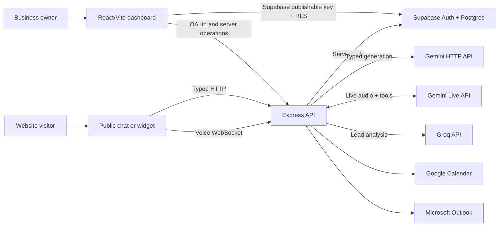
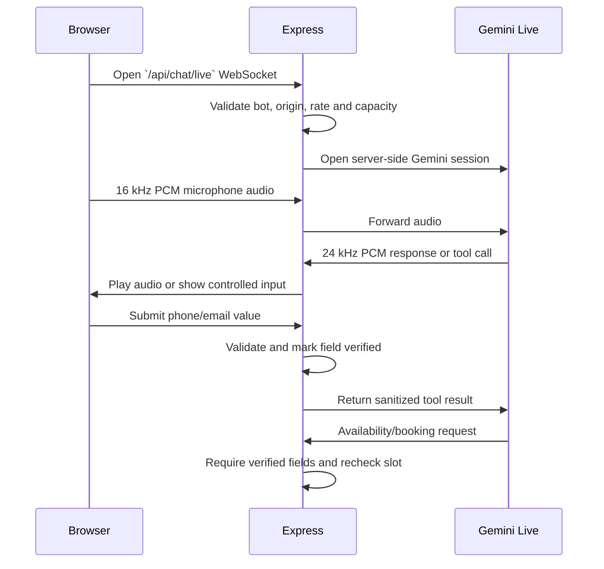

# AI Receptionist

Multi-tenant SaaS for creating AI receptionists that answer typed and voice conversations, qualify leads, and book calendar appointments. Each receptionist can be used through a hosted public chat page or an embeddable website widget.

This README is the primary orientation document for humans and coding agents. Treat the running code and ordered Supabase migrations as the final source of truth when this document and an old design note disagree.

## AI maintainer briefing

Read this section before changing the project.

| Question | Answer |
| --- | --- |
| What is the product? | A dashboard where business owners configure AI receptionists, review conversations and leads, connect calendars, and install a website widget. |
| What runs in production? | A React/Vite SPA, a long-lived Express server with HTTP and WebSocket endpoints, and Supabase Auth/Postgres. |
| What are the public surfaces? | `/chats/:subdomain`, `/widget/loader.js`, the widget iframe, typed chat APIs, and the live-voice WebSocket. |
| Where do AI requests go? | Typed chat uses Gemini HTTP, live voice uses Gemini Live through the backend, and post-conversation lead analysis uses Groq. |
| Where is authorization enforced? | Supabase RLS protects owner-facing browser queries. Express performs trusted server operations and validates widget origins, sessions, tool arguments, and contact data. |
| What is not active architecture? | Supabase Edge Functions in `server/supabase/functions/` are legacy/optional. Do not edit them expecting the Express runtime to change. |

### Non-negotiable invariants

1. Never expose `SUPABASE_SERVICE_ROLE_KEY`, `GEMINI_API_KEY`, calendar tokens, the full bot row, or `knowledge_base` to a visitor browser.
2. Do not trust Gemini to confirm identity, contact details, appointment eligibility, or tool arguments. The backend owns those decisions.
3. Widget visibility and chat access both require an allowed origin. Removing a domain must prevent the launcher from rendering after its configuration is fetched again.
4. Live contact collection requests one field at a time. While a field is pending, voice output and unrelated client events are blocked until the server validates a real submission.
5. A booking must use server-verified contact fields and a freshly rechecked calendar slot.
6. Keep the live-voice backend to one replica while Gemini guard limits and queues are process-local.
7. Apply every Supabase migration in order. Later hardening migrations intentionally replace permissive policies from early migrations.

## Product capabilities

Business owners can:

- Sign in with Supabase Auth.
- Create and configure multiple AI receptionists, called `bots` in the database and API.
- Set a business profile, greeting, knowledge base, language, widget appearance, required lead fields, and allowed domains.
- Preview public typed and voice conversations.
- Embed a launcher and iframe widget on an approved website.
- Connect Google Calendar or Microsoft Outlook.
- Review conversations, leads, scores, summaries, and appointments.

Visitors can:

- Chat through a hosted public page or embedded widget.
- Speak to the receptionist through Gemini Live.
- Provide validated contact information through server-controlled inputs.
- Ask for available times and book an appointment.

## System architecture



### Runtime workloads

| Workload | Default model/service | Purpose |
| --- | --- | --- |
| Typed chat | `gemini-2.5-flash-lite` | Answers from the bot knowledge base and requests calendar tools. Configurable with `GEMINI_MODEL`. |
| Live voice | `models/gemini-3.1-flash-live-preview` | Streams audio and performs controlled tool calls through the Express WebSocket proxy. |
| Lead analysis | Groq `llama-3.1-8b-instant` | Extracts lead fields, sentiment, score, summary, and appointment state after conversations. |
| Inbound phone calls | Dograh (self-hosted, separate service) | Answers real phone numbers using a voice agent provisioned from the same business persona/knowledge base; calls are mirrored into Supabase. See [Phone calls/README.md](Phone%20calls/README.md). |

There is currently no embedding or vector-search layer. The complete `bots.knowledge_base` is added to the Gemini prompt. This is simple, but prompt size and cost grow with the knowledge base.

## End-to-end request flows

### Owner dashboard

1. Supabase Auth creates the browser session.
2. Protected React routes require an authenticated user.
3. The dashboard reads and writes owner data directly through the Supabase publishable key.
4. Row Level Security restricts those queries to the authenticated owner.
5. Sensitive operations, such as calendar OAuth, go through Express.

### Typed public chat

1. The client loads a safe public bot projection by bot ID or subdomain.
2. Express checks that the bot is active and, for widgets, that the request origin is allowed.
3. A chat session and greeting are persisted by the server.
4. For each reply, Express loads the newest 20 messages, then reverses them into chronological prompt order.
5. Gemini receives the recent history, business instructions, complete knowledge base, timezone, and permitted tools.
6. Express executes any availability or booking request. Gemini never calls a calendar provider directly.
7. Messages are persisted, then Groq lead analysis runs in the background.

The public bot response is intentionally limited to presentation fields such as name, greeting, color, languages, subdomain, and merged widget configuration. It must not include the owner ID, knowledge base, or allowed-domain list.

### Embedded widget

1. A host page loads `GET /widget/loader.js` with `data-bot-id`.
2. The loader requests the bot's safe widget configuration before drawing anything.
3. Express validates `Origin` or `Referer` against `bots.allowed_domains`.
4. Only an authorized page receives configuration and renders the launcher and iframe.
5. The iframe repeats origin validation for chat and voice operations. The iframe permits microphone access.

Allowed-domain matching supports exact hosts, wildcard subdomains such as `*.example.com`, and local loopback equivalents for development. `ALLOW_ALL_WIDGET_DOMAINS=true` bypasses this protection and must remain `false` in production.

### Live voice and contact collection



The browser never receives the Gemini API key. The server's live-contact state is authoritative:

- Gemini must call `request_text_input`; it must not merely say that an input is visible.
- Only one input can be pending, preventing phone and email fields from overlapping.
- Opening an input clears queued assistant audio and mutes the microphone.
- Empty submissions and phrases such as “done” do not verify a field.
- Phone numbers are validated with `libphonenumber-js` and reject implausible repeated or sequential patterns.
- Email addresses receive structural validation.
- Booking is blocked until every required field has a verified server value.
- Verified values overwrite any phone or email supplied in Gemini's booking arguments.

`GeminiGuard` currently permits three concurrent sessions, queues up to five more for 30 seconds, limits new sessions and token budget, warns the assistant at four minutes, and ends the call at five minutes. These counters live in one Node.js process.

### Calendar booking

1. An owner connects Google or Microsoft through `/api/calendar` OAuth routes.
2. OAuth state is random, stored only as a hash, atomically consumed once, and inaccessible to normal browser roles.
3. The chatbot asks Express for availability.
4. Before booking, Express validates contact details and checks the exact slot again.
5. Booking is serialized per session and limited to one appointment per session.
6. The external calendar event is created first; the local appointment is saved only after provider success.

### Lead analysis

Typed responses trigger background analysis, and a live call triggers analysis from its transcript when the socket closes. Groq extracts or updates:

- name and phone;
- requirement and budget;
- sentiment and lead score;
- summary;
- appointment status.

Lead records are upserted by session. If `GROQ_API_KEY` is absent or Groq fails, the conversation continues, but automatic lead analysis may be skipped.

## Repository map

```text
.
├── client/                         React 19, TypeScript, Vite, Tailwind 4
│   └── src/
│       ├── components/             Auth, chat, dashboard, landing, layout, UI
│       ├── hooks/                  Shared client behavior, including live voice
│       ├── modules/phone-calls/    Calls tab: Dograh provisioning UI + call history
│       ├── pages/                  Dashboard, agents, leads, inbox, calendar
│       ├── services/               Supabase and API clients
│       └── App.tsx                 Client route definitions
├── server/                         Express, TypeScript, WebSocket backend
│   ├── src/
│   │   ├── controllers/            Chat, widget, calendar, lead, live voice
│   │   ├── middleware/             Authentication and request controls
│   │   ├── modules/phone-calls/    Dograh client, persona builder, call mirroring/poller, routes
│   │   ├── services/               Gemini guard/tools and calendar adapters
│   │   ├── utils/                  Security and contact validation
│   │   └── index.ts                Active backend entry point
│   ├── supabase/
│   │   ├── migrations/             Ordered database schema and policy history
│   │   └── functions/              Legacy/optional Edge Functions
│   └── tests/                      Backend integration and regression tests
├── docs/
│   ├── AWS_DEPLOYMENT.md           Detailed AWS deployment runbook
│   └── superpowers/                Historical design specs and implementation plans
├── Phone calls/                    Architecture notes for inbound phone calls (Dograh); runtime code lives under server/client modules above
├── package.json                    Root orchestration scripts
└── Readme.md                       This architecture and maintenance guide
```

### Key files by change type

| Task | Start here |
| --- | --- |
| Change app routes | `client/src/App.tsx` |
| Change public chat UI | `client/src/components/chat/PublicChatView.tsx` |
| Change live voice client behavior | `client/src/hooks/useLiveVoice.ts`, `client/src/components/chat/VoiceCallView.tsx` |
| Change typed chat behavior | `server/src/controllers/chatController.ts` |
| Change Gemini Live behavior | `server/src/controllers/liveChatController.ts` |
| Change live tools or input protocol | `server/src/services/liveTools.ts` |
| Change contact validation | `server/src/utils/contactValidation.ts` |
| Change voice quotas or duration | `server/src/services/geminiGuard.ts` |
| Change widget loader or iframe | `server/src/controllers/widgetController.ts` |
| Change domain/origin security | `server/src/utils/security.ts` |
| Change calendar behavior | `server/src/controllers/calendarController.ts`, `server/src/services/calendar/` |
| Change booking transaction rules | `server/src/services/calendar/calendarOperations.ts` |
| Change lead extraction | `server/src/controllers/leadController.ts` |
| Change schema or RLS | Add a migration under `server/supabase/migrations/` |
| Change server routing | `server/src/index.ts` |
| Change inbound phone call behavior (Dograh) | `server/src/modules/phone-calls/` (see [Phone calls/README.md](Phone%20calls/README.md)), `client/src/modules/phone-calls/` |
| Change the shared receptionist persona text | `server/src/modules/phone-calls/receptionistInstruction.ts` (used by both Gemini Live and Dograh) |

## Data model

| Table | Responsibility |
| --- | --- |
| `profiles` | User profile associated with Supabase Auth. |
| `bots` | Receptionist identity, instructions, knowledge base, domains, and widget config. |
| `chat_sessions` | One visitor conversation and its owning bot. |
| `messages` | Ordered visitor and assistant messages. |
| `leads` | Extracted contact, qualification, score, summary, and booking state. |
| `calendar_connections` | Encrypted/provider OAuth connection metadata per owner. |
| `appointments` | Locally persisted bookings linked to bot/session/provider event. |
| `calendar_oauth_states` | Short-lived, hashed, single-use OAuth state records. |
| `phone_calls` | One row per Dograh inbound call run, mirrored into `chat_sessions`/`messages`/`leads`. |

Anonymous visitors do not query or insert these records directly. Express uses the Supabase service role for validated public-chat operations. Owner dashboard queries use the publishable key and RLS.

## Client routes

| Route | Access | Purpose |
| --- | --- | --- |
| `/` | Public | Landing page. |
| `/auth?mode=signin` | Public | Sign in. |
| `/auth?mode=signup` | Public | Create account. |
| `/chats/:subdomain` | Public | Hosted receptionist chat. |
| `/dashboard` | Authenticated | Account overview. |
| `/leads` | Authenticated | Lead pipeline. |
| `/inbox` | Authenticated | Conversation history. |
| `/calendar` | Authenticated | Calendar and appointments. |
| `/calls` | Authenticated | Inbound phone agent provisioning and call history (Dograh). |
| `/agents` | Authenticated | Receptionist list. |
| `/agents/new` | Authenticated | Create receptionist. |
| `/agents/:botId/:tab` | Authenticated | `overview`, `knowledge`, `install`, or `preview`. |

## Backend surface

The active HTTP server is `server/src/index.ts`.

| Route | Purpose |
| --- | --- |
| `GET /health` | Backend health and Gemini guard state. |
| `POST /api/chat/session` | Create an anonymous chat session. |
| `POST /api/chat/reply` | Generate and persist a typed reply. |
| `GET /api/chat/bot/:botId` | Safe public bot configuration by ID. |
| `GET /api/chat/bot/subdomain/:subdomain` | Safe public bot configuration by subdomain. |
| `WS /api/chat/live` | Gemini Live voice proxy and tool protocol. |
| `GET /widget/loader.js` | Embeddable widget bootstrap script. |
| `GET /widget/:botId` | Widget iframe application. |
| `GET /api/calendar/auth-url` | Authenticated provider OAuth start. |
| `GET /api/calendar/callback/:provider` | Google/Microsoft OAuth callback. |
| `GET /api/calendar/status` | Authenticated connection status. |
| `GET /api/dograh/bots/:botId/status` | Authenticated phone-agent provisioning status. |
| `POST /api/dograh/bots/:botId/provision` | Authenticated: create/update the Dograh inbound phone agent from the bot's persona. |
| `GET /api/dograh/numbers` | Authenticated: list Dograh phone numbers not claimed by another bot. |
| `POST /api/dograh/bots/:botId/assign-number` | Authenticated: bind a phone number's inbound routing to this bot's agent. |
| `POST /api/dograh/bots/:botId/call` | Authenticated: place a single ad-hoc outbound call from the bot's assigned number. |
| `GET /api/dograh/bots/:botId/calls` | Authenticated, read-only: mirrored phone call history (inbound and outbound) with lead outcomes. |
| `POST /api/dograh/bots/:botId/sync` | Authenticated: on-demand pull of new Dograh call runs (the poller also runs this automatically). |

Global CORS is restricted by trusted runtime origins. Widget authorization is a separate, stricter bot-specific origin check. Do not replace either layer with unrestricted `cors()`.

## Local development

### Prerequisites

- Node.js 20 or newer.
- npm.
- A Supabase project.
- A Gemini API key.
- Optional Groq, Google Calendar, and Microsoft Graph credentials for those features.

### Install

```bash
npm run install:all
```

### Configure environment

Create `client/.env`:

```dotenv
VITE_SUPABASE_URL=https://YOUR_PROJECT.supabase.co
VITE_SUPABASE_PUBLISHABLE_KEY=YOUR_PUBLISHABLE_KEY
VITE_EXPRESS_SERVER_URL=http://localhost:4000
VITE_WIDGET_BASE_URL=http://localhost:4000
```

Create `server/.env`:

```dotenv
SUPABASE_URL=https://YOUR_PROJECT.supabase.co
SUPABASE_SERVICE_ROLE_KEY=YOUR_SERVICE_ROLE_KEY
GEMINI_API_KEY=YOUR_GEMINI_KEY
GROQ_API_KEY=

PORT=4000
CLIENT_URL=http://localhost:3000
EXPRESS_SERVER_URL=http://localhost:4000
WIDGET_BASE_URL=http://localhost:4000

ALLOW_ALL_WIDGET_DOMAINS=false
WIDGET_RATE_LIMIT_PER_MINUTE=120
CHAT_RATE_LIMIT_PER_MINUTE=60
LIVE_VOICE_RATE_LIMIT_PER_MINUTE=20

# Optional Gemini typed-chat tuning
GEMINI_MODEL=gemini-2.5-flash-lite
GEMINI_MAX_RETRIES=2

# Optional provider credentials
GOOGLE_CLIENT_ID=
GOOGLE_CLIENT_SECRET=
GOOGLE_REDIRECT_URI=
MICROSOFT_CLIENT_ID=
MICROSOFT_CLIENT_SECRET=
MICROSOFT_REDIRECT_URI=
```

Use the exact variable names in the repository `.env.example` files if they change. Never commit `.env` files or real credentials.

### Apply the database

Apply every SQL file in `server/supabase/migrations/` in filename order. The final policy state matters: early schema files contain historical public policies that later hardening migrations remove.

### Run

```bash
# Client and Express server
npm run dev

# Or run either process separately
npm run dev:client
npm run dev:server
```

Default URLs:

- Client: `http://127.0.0.1:3000`
- Express: `http://localhost:4000`
- Health check: `http://localhost:4000/health`

The root `dev:functions` and `dev:all` scripts also start legacy Supabase Edge Functions. They are not required for the active Express path.

## Verification

Run these before opening a pull request or deploying:

```bash
cd server
npm run typecheck
npm test

cd ../client
npm run build
```

The server regression suite covers CORS, newest-message history, safe public bot projections, widget protocol and domains, live contact collection, calendar transactions, OAuth state, migrations, and repository hygiene.

For changes to public chat, voice, contact collection, or booking, test both surfaces end to end:

1. Hosted preview at `/chats/:subdomain`.
2. An actual embedded widget on an allowed origin.
3. The same widget after its domain is removed.
4. Invalid and empty phone/email submissions.
5. A valid availability and booking flow.

## Deployment

### Supported shape

- Deploy `client/` as a static SPA on Vercel, S3/CloudFront, Amplify, or an equivalent host.
- Deploy `server/` on a long-lived Node.js platform with WebSocket support, such as Railway or ECS/Fargate behind an Application Load Balancer.
- Keep Supabase as the managed Auth/Postgres service.

The backend cannot be deployed as a short-lived serverless HTTP function because live voice requires persistent WebSocket connections. The server Dockerfile uses Node 20 Alpine, runs as a non-root user, and exposes port 4000.

For the detailed AWS topology, secrets, load balancer settings, and rollout procedure, read [docs/AWS_DEPLOYMENT.md](docs/AWS_DEPLOYMENT.md).

### Production checklist

- `ALLOW_ALL_WIDGET_DOMAINS=false`.
- `CLIENT_URL`, `EXPRESS_SERVER_URL`, and `WIDGET_BASE_URL` use production HTTPS origins.
- Frontend `VITE_*` URLs point at the deployed services.
- Supabase service role and AI/provider credentials exist only in backend secrets.
- All migrations have been applied and RLS is enabled.
- WebSocket upgrade forwarding is enabled at the load balancer/proxy.
- `/health` succeeds.
- One backend replica is used until voice capacity and rate-limit state move to shared storage.
- A real allowed-domain widget, revoked-domain widget, typed chat, voice call, and calendar booking are smoke-tested.

## Known limitations

- The entire knowledge base is prompt-injected; large documents need chunking or retrieval before this scales efficiently.
- Gemini guard concurrency, queue, and rate counters are in memory and are not shared across replicas.
- General HTTP rate limiting is also process-local.
- Outlook availability support does not yet have complete parity with Google slot calculation.
- The application does not send SMS or email booking confirmations.
- Groq lead analysis is eventually consistent and optional; a successful chat does not guarantee an updated lead record when Groq is unavailable.
- Files under `docs/superpowers/` describe decisions at a point in time. Verify them against current code before implementation.
- Dograh phone calls do not yet support live calendar booking or sequential server-verified contact capture during the call; booking requests are routed to verbal contact capture and human follow-up. Dograh OSS exposes no run-completion webhook, so call mirroring is poll-based (default 60s) plus a manual "Sync now" action, not real-time. Tenant isolation across bots for phone numbers is enforced by this app, not by Dograh (it is a single org/service account).
- Outbound calling supports only single ad-hoc calls with no per-call personalization (Dograh's `initiate-call` API has no field for dynamic context like a lead's name or reason for the call), and no bulk/campaign dialing.

## AI change protocol

When an AI agent modifies this repository:

1. Identify the active runtime path before editing. Prefer `server/src/` over legacy Edge Functions.
2. Trace the complete request from browser component to Express controller, database operation, provider call, and response.
3. Inspect both the hosted public preview and widget implementation. Similar UI does not guarantee shared behavior.
4. Preserve trust boundaries. Treat model speech and tool arguments as untrusted input.
5. Put validation and booking gates on the server, not only in React.
6. Return only the safe public bot projection to anonymous callers.
7. Keep phone/email collection sequential and server-confirmed.
8. Add or update a regression test for the exact failure before considering a bug fixed.
9. Run server typecheck/tests and the client production build.
10. Update this README when architecture, routes, models, environment variables, deployment assumptions, or security invariants change.

### Definition of done

A change is not complete because the model produced the expected sentence once. It is complete when:

- the server enforces the rule independently of model behavior;
- both public preview and embedded widget flows behave correctly;
- failure cases are covered by automated tests;
- typecheck, tests, and production build pass;
- secrets and private bot data stay behind the backend boundary;
- deployment assumptions and documentation still match the code.
