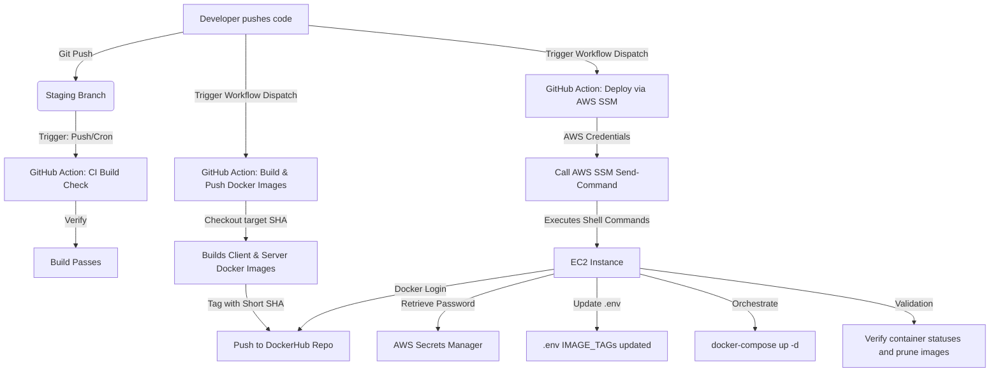

# Git, Build, Push & Deployment Workflow Reference Guide

This document details the complete CI/CD pipeline and Git workflow used in the **Recrui8** project. It serves as a comprehensive, self-contained reference that you can copy to any other project to easily recreate the same build, push, and deployment mechanics.

---

## 1. Workflow Architecture Overview

The Recrui8 workflow consists of three primary stages:
1. **Continuous Integration (CI)**: Automates project builds on push/pull-request events to verify code integrity before merging.
2. **Build and Push (Dockerization)**: Triggered manually via GitHub Actions. It compiles the client and server code, packages them into optimized Docker containers, tags them with the short commit SHA, and pushes them to DockerHub.
3. **Continuous Deployment (CD via AWS SSM)**: Triggered manually via GitHub Actions. It leverages **AWS Systems Manager (SSM) Send-Command** to securely trigger container updates on an EC2 instance. This eliminates the need to store SSH keys inside GitHub Secrets.



---

## 2. Git Workflow (GitWork)

To manage code quality and smooth releases, the Git branching model is structured as follows:

*   **Feature Branches (`feature/your-feature`)**: Developers work on independent features/bugfixes here and submit Pull Requests to the staging branch.
*   **Staging Branch (`staging`)**: Acts as the pre-production environment. 
    *   **CI Check**: Pushes to `staging` automatically run the `Build project` workflow to ensure there are no compilation errors.
    *   **Manual Deployment**: Workflows are dispatched to build Docker images and deploy to the EC2 staging instance.
*   **Production/Deployment Branches (e.g., `main` or specific deploy tags)**: Code is merged from `staging` after verification. Deployment workflows are run to release the production-configured builds.

---

## 3. GitHub Actions Workflows (Templates)

Create these files in your new project's `.github/workflows/` directory.

### 3.1. Build Project Check (CI)
Save as: `.github/workflows/build-project.yml`
*This action runs on every push to the staging branch or daily to ensure client/server packages install and compile successfully.*

```yaml
name: Build project

on:
  push:
    branches:
      - staging
  schedule:
    - cron: '0 0 * * *'  # Every day at midnight UTC

jobs:
  build:
    runs-on: ubuntu-latest
    environment: dev

    strategy:
      matrix:
        folder: [client, server]

    steps:
      - name: Checkout code
        uses: actions/checkout@v3

      - name: Set up Node.js
        uses: actions/setup-node@v3
        with:
          node-version: "20.11.1"

      - name: Install and Build
        working-directory: ${{ matrix.folder }}
        run: |
          npm install
          npm run build
        env:
          # Define environment variables required at build time
          NEXT_PUBLIC_FRONTEND_API_KEY: ${{ vars.NEXT_PUBLIC_FRONTEND_API_KEY }}
          NEXT_PUBLIC_FRONTEND_AUTH_DOMAIN: ${{ vars.NEXT_PUBLIC_FRONTEND_AUTH_DOMAIN }}
          NEXT_PUBLIC_FRONTEND_PROJECT_ID: ${{ vars.NEXT_PUBLIC_FRONTEND_PROJECT_ID }}
          NEXT_PUBLIC_FRONTEND_STORAGE_BUCKET: ${{ vars.NEXT_PUBLIC_FRONTEND_STORAGE_BUCKET }}
          NEXT_PUBLIC_FRONTEND_MESSAGING_SENDER_ID: ${{ vars.NEXT_PUBLIC_FRONTEND_MESSAGING_SENDER_ID }}
          NEXT_PUBLIC_FRONTEND_APP_ID: ${{ vars.NEXT_PUBLIC_FRONTEND_APP_ID }}
          NEXT_PUBLIC_FRONTEND_MEASUREMENT_ID: ${{ vars.NEXT_PUBLIC_FRONTEND_MEASUREMENT_ID }}
```

### 3.2. Docker Build & Push
Save as: `.github/workflows/docker-image-staging.yml`
*Builds the server and client Docker images, tags them with the short commit SHA, and pushes them to DockerHub.*

```yaml
name: STAGING-Build and Push Docker Images

on:
  workflow_dispatch:
    inputs:
      commit_sha:
        description: "Full Commit SHA to build from"
        required: true

jobs:
  deploy:
    if: github.ref == 'refs/heads/staging' # Restrict to staging branch
    runs-on: ubuntu-latest
    environment: staging

    steps:
      - name: Checkout code
        uses: actions/checkout@v3
        with:
          ref: ${{ github.event.inputs.commit_sha }}

      - name: Get short commit SHA
        run: |
          COMMIT_SHA="${{ github.event.inputs.commit_sha }}"
          SHORT_SHA=$(echo $COMMIT_SHA | cut -c1-7)
          echo "SHORT_SHA=$SHORT_SHA" >> $GITHUB_ENV

      - name: Set deployment environment variable
        run: echo "DEPLOYMENT_ENV=staging" >> $GITHUB_ENV

      - name: Set up Node.js
        uses: actions/setup-node@v3
        with:
          node-version: "20.11.1"

      - name: Log in to DockerHub
        uses: docker/login-action@v2
        with:
          username: ${{ secrets.DOCKER_USERNAME }}
          password: ${{ secrets.DOCKER_PASSWORD }}

      - name: Build Server Docker Image
        run: |
          docker buildx build \
            --platform linux/amd64 \
            --build-arg deployment_env=${{ env.DEPLOYMENT_ENV }} \
            -t ${{ secrets.DOCKER_USERNAME }}/your-repo-name:server-staging-${{ env.SHORT_SHA }} \
            -f Dockerfile.server .

      - name: Push Server Docker image
        run: |
          docker push ${{ secrets.DOCKER_USERNAME }}/your-repo-name:server-staging-${{ env.SHORT_SHA }}

      - name: Build Client Docker Image
        run: |
          docker buildx build \
            --platform linux/amd64 \
            --build-arg deployment_env=${{ env.DEPLOYMENT_ENV }} \
            -t ${{ secrets.DOCKER_USERNAME }}/your-repo-name:client-staging-${{ env.SHORT_SHA }} \
            -f Dockerfile.client .

      - name: Push Client Docker image
        run: |
          docker push ${{ secrets.DOCKER_USERNAME }}/your-repo-name:client-staging-${{ env.SHORT_SHA }}
```

### 3.3. Deploy to EC2 via AWS SSM
Save as: `.github/workflows/deploy-via-ssm.yml`
*Connects to AWS and executes deployment commands directly on the host using AWS Systems Manager.*

```yaml
name: Deploy via SSM

on:
  workflow_dispatch:
    inputs:
      commit_sha:
        description: "Full Commit SHA to deploy"
        required: true

jobs:
  deploy:
    runs-on: ubuntu-latest
    environment: staging

    steps:
      - name: Configure AWS CLI
        uses: aws-actions/configure-aws-credentials@v2
        with:
          aws-access-key-id: ${{ secrets.AWS_ACCESS_KEY_ID }}
          aws-secret-access-key: ${{ secrets.AWS_SECRET_ACCESS_KEY }}
          aws-region: ${{ secrets.AWS_REGION }}

      - name: Send SSM Command to EC2
        run: |
          COMMIT_SHA="${{ github.event.inputs.commit_sha }}"
          SHORT_SHA=$(echo $COMMIT_SHA | cut -c1-7)

          aws ssm send-command \
            --instance-ids "${{ secrets.EC2_INSTANCE_ID }}" \
            --document-name "AWS-RunShellScript" \
            --comment "Deploying commit $SHORT_SHA" \
            --parameters '{
              "commands": [
                "set -e",
                "cd /home/ec2-user/your-project-folder",
                "echo 🔐 Fetching DockerHub password from AWS Secrets Manager...",
                "DOCKER_PASS=$(aws secretsmanager get-secret-value --secret-id dockerhub-repo-password --query SecretString --output text)",
                "echo 🔑 Logging in to Docker Hub...",
                "echo $DOCKER_PASS | docker login -u ${{ secrets.DOCKER_USERNAME }} --password-stdin",
                "echo ✏️ Updating .env...",
                "sed -i \"s/^IMAGE_TAG_SERVER=.*/IMAGE_TAG_SERVER=server-staging-'$SHORT_SHA'/\" .env",
                "sed -i \"s/^IMAGE_TAG_CLIENT=.*/IMAGE_TAG_CLIENT=client-staging-'$SHORT_SHA'/\" .env",
                "echo 📄 Updated tags:",
                "grep '\''^IMAGE_TAG_'\'' .env",
                "docker-compose -f docker-compose-staging.yml up -d",
                "sleep 30",
                "docker image prune -a -f",
                "docker-compose ps",
                "EXIT_CONTAINERS=$(docker-compose -f docker-compose-staging.yml ps | grep Exit || true)",
                "if [ -n \"$EXIT_CONTAINERS\" ]; then echo \"$EXIT_CONTAINERS\" && exit 1; else echo ✅ Deployment successful; fi"
              ]
            }'
```

---

## 4. Dockerization Templates

These configurations are designed for a repository splitting frontend (client) and backend (server) into subfolders, but they can be adjusted.

### 4.1. Server Dockerfile (`Dockerfile.server`)
Create in the root of the project:

```dockerfile
# Use the Node.js base image
FROM node:20-alpine

# Set the working directory
WORKDIR /app

# Copy package.json and install dependencies
COPY server/package*.json ./

# Install dependencies conditionally based on environment arguments
ARG deployment_env
RUN if [ "$deployment_env" = "production" ]; then \
        npm install --only=production; \
    else \
        npm install; \
    fi

# Copy all server code
COPY server/ ./

# Expose server port
EXPOSE 4080

# Start command
CMD ["node", "server.js"]
```

### 4.2. Client Dockerfile (`Dockerfile.client`)
Create in the root of the project (uses a multi-stage build to keep the production container lightweight):

```dockerfile
# Step 1: Build the client application
FROM node:20-alpine AS build

WORKDIR /app

# Set build-time environment variables (e.g. Next.js PUBLIC ENV keys)
ENV DEPLOY_ENV=production
ENV NODE_ENV=production
# Add your environment variables here...
# ENV NEXT_PUBLIC_BASE_URL=...

# Copy package.json and install dependencies
COPY client/package*.json ./
RUN npm install

# Copy application files and build
COPY client/ ./
RUN npm run build

# Step 2: Set up the production running container
FROM node:20-alpine

WORKDIR /app

# Copy built assets and configurations from build step
COPY --from=build /app/.next ./.next
COPY --from=build /app/public ./public
COPY --from=build /app/package*.json ./
COPY --from=build /app/next.config.mjs ./

# Install only production dependencies
RUN npm install --only=production

# Expose port and run server
EXPOSE 3000
CMD ["npm", "start"]
```

### 4.3. Docker Compose Orchestration (`docker-compose-staging.yml`)
Create in the root of the project on both your development environment and the production server:

```yaml
services:
  client:
    image: recrui8dev/recrui8-dockerhub-repo-dev:${IMAGE_TAG_CLIENT}
    container_name: recrui8-client
    ports:
      - "3000:3000"
    env_file:
      - .env

  server:
    image: recrui8dev/recrui8-dockerhub-repo-dev:${IMAGE_TAG_SERVER}
    container_name: recrui8-server
    ports:
      - "127.0.0.1:4080:4080" # Binds to localhost for reverse proxying via Nginx
    env_file:
      - .env
```

---

## 5. Deep-Dive: AWS SSM Deployment Mechanics

Rather than copying SSH keys onto GitHub, this project uses **AWS SSM (Systems Manager)**. Here is exactly what happens when the SSM script executes:

1.  **Directory Change**: Navigates to `/home/ec2-user/your-project-folder` where the codebase and `docker-compose-staging.yml` configuration resides.
2.  **AWS Secrets Manager Retrieval**: 
    ```bash
    DOCKER_PASS=$(aws secretsmanager get-secret-value --secret-id dockerhub-repo-password --query SecretString --output text)
    ```
    Retrieves the DockerHub password stored securely in AWS Secrets Manager and assigns it to a variable, meaning passwords are never printed or stored on GitHub.
3.  **Docker Login**: logs in using `docker login` piped from standard input.
4.  **Tag Substitution**:
    ```bash
    sed -i "s/^IMAGE_TAG_SERVER=.*/IMAGE_TAG_SERVER=server-staging-'$SHORT_SHA'/" .env
    ```
    Uses `sed` to edit the `.env` file on the fly, substituting the current values of `IMAGE_TAG_CLIENT` and `IMAGE_TAG_SERVER` with the new tags containing the commit short SHA.
5.  **Restart Containers**: Runs `docker-compose up -d`. Docker Compose reads the `.env` variables, realizes the images have changed, pulls the new images from DockerHub automatically, and replaces the containers with minimal downtime.
6.  **Cleanup**: Runs `docker image prune -a -f` to clean up dangling Docker images from previous versions and prevent the server storage from filling up.
7.  **Container Status Check**: Validates the status of the new containers. If any container has exited, the script exits with `exit 1` to alert GitHub Actions of a failed deployment.

---

## 6. How to Set Up This Workflow in a New Project

Follow these steps to replicate this setup for another project:

### Step 1: Set Up DockerHub
1. Create a DockerHub Repository (e.g. `your-username/your-repo-name`).
2. Generate an Access Token in DockerHub Account Settings for secure authentication.

### Step 2: Configure GitHub Secrets
Navigate to **GitHub Repository Settings** -> **Secrets and variables** -> **Actions**, and add the following secrets:
*   `DOCKER_USERNAME`: Your DockerHub username.
*   `DOCKER_PASSWORD`: Your DockerHub password or Access Token.
*   `AWS_ACCESS_KEY_ID`: IAM user access key.
*   `AWS_SECRET_ACCESS_KEY`: IAM user secret access key.
*   `AWS_REGION`: The AWS region of your EC2 instance (e.g. `ap-south-1`).
*   `EC2_INSTANCE_ID`: The AWS EC2 Instance ID where the app is hosted (e.g., `i-xxxxxxxxxxxxxxxxx`).

### Step 3: Configure AWS IAM Permissions
Create an IAM User in AWS with programmatic access and attach a policy allowing it to interact with systems manager.
Sample IAM policy for GitHub Actions:
```json
{
    "Version": "2012-10-17",
    "Statement": [
        {
            "Effect": "Allow",
            "Action": [
                "ssm:SendCommand",
                "ssm:GetCommandInvocation"
            ],
            "Resource": [
                "arn:aws:ssm:*:*:document/AWS-RunShellScript",
                "arn:aws:ec2:YOUR-REGION:YOUR-ACCOUNT-ID:instance/YOUR-INSTANCE-ID"
            ]
        }
    ]
}
```

### Step 4: Configure the EC2 Server
1.  **Install SSM Agent**: Ensure the AWS SSM Agent is running on the EC2 instance (it is pre-installed on Amazon Linux 2 / Linux 2023).
2.  **Attach IAM Role to EC2**: Attach an IAM Instance Profile/Role to your EC2 instance containing the `AmazonSSMManagedInstanceCore` and `SecretsManagerReadWrite` policies (so the EC2 instance can talk to SSM and read from Secrets Manager).
3.  **Install Docker and Compose**:
    ```bash
    sudo yum update -y
    sudo dnf install docker -y # Amazon Linux 2023
    sudo systemctl enable docker --now
    sudo usermod -aG docker ec2-user
    # Install Docker Compose
    sudo curl -L "https://github.com/docker/compose/releases/latest/download/docker-compose-$(uname -s)-$(uname -m)" -o /usr/local/bin/docker-compose
    sudo chmod +x /usr/local/bin/docker-compose
    ```
4.  **Set Up the Application Folder**:
    *   Create `/home/ec2-user/your-project-folder`.
    *   Add your `.env` file with initial image tag variables:
        ```env
        IMAGE_TAG_CLIENT=client-staging-placeholder
        IMAGE_TAG_SERVER=server-staging-placeholder
        ```
    *   Add your `docker-compose-staging.yml` file to this folder.
5.  **Configure AWS Secrets Manager**:
    *   Create a secret named `dockerhub-repo-password` of type **Plaintext** containing your DockerHub password/token.
